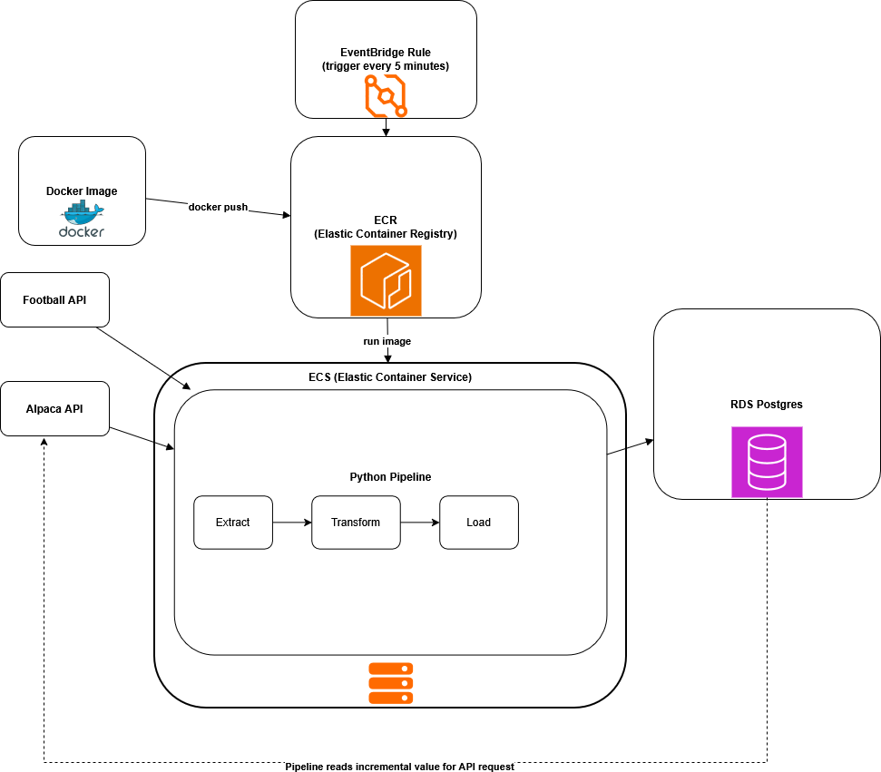
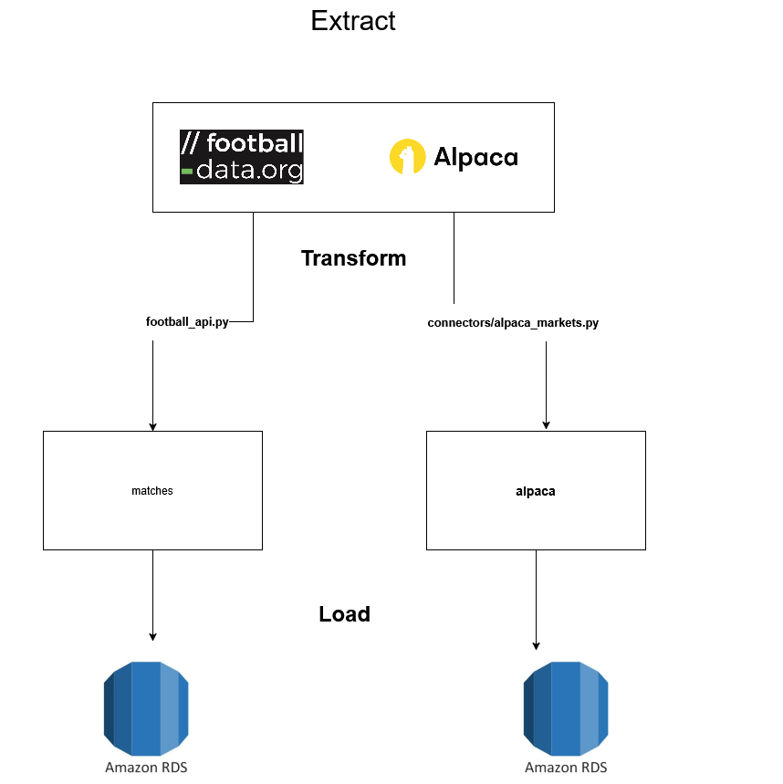

# Football-DataPipeline

## About
A data pipeline using data from [football-data API](https://www.football-data.org/) and [Alpaca](https://alpaca.markets/) API.

## Objective:

Develop an ETL pipeline to process live sports data via football API. Another data pipeline collecting live stock data from Alpaca markets on Manchester United PLC (MANU) runs in parallel. 

## Technical Highlights:

- Built Python Pipelines to extract real time data from football-data API and Alpaca Markets's API.
- Loaded the extracted data in chunks via Upsert to Amazon RDS database.
- Scheduled Python Pipelines to run on a schedule and parallel via YAML and schedule library.
- Extract raw data from PostgreSQL database and further process it with a PostgreSQL transform making a total of 3 tables.
- Implement unit testing for two functions on the Football pipeline.

## Technologies:
- AWS, ECR, ECS, EventBridge, Docker, Amazon RDS Postgres, Python, CI/CD (Github), SQL, YAML, Pytest

## Architecture 

## Pipeline

## Steps for creation and deployment
1. Create RDS database
    - connect with pgAdmin, create database
2. Make docker image from python pipeline
    - `docker build -t project1_etl:latest`
    - `docker run --env-file .env project1_etl:latest`
    - make sure it runs locally before trying to put onto ECS
3. In ECR create private repository
    - select the repository and then "view push commands", which we will use to push the docker image
    - but first we need to do `aws configure` and login
    - run the provided login command
    - run the provided command to "tag the build"
    - run the provided command to "push to ECR"
4. Create ECS cluster
    - configuration...
        - method: Fargate and self-managed
        - container instance AMI: Linux 2023 image
        - desired capacity: min 1, max 1
        - network settings -> assign public IP: turn on
    - our cluster should be created and provisioned with 1 container instance
5. Create secrets in secret manager
    - when creating new secret select "other type of secret"
    - select plaintext, and replace anything in that field with your secret's value
    - on the next page, the secret name will be how you access that secret
6. Create task definition
    - in task definition in ECS, we will create new task definition
    - configuration...
        - launch type: ECS2 instance and FarGate
        - CPU: 0.25 vCPU 0.5
        - memory: 0.5 GB 2
        - name the container!
        - image URI...
            - choose reposity, image, then image tag
            - select image by: image tag
        - environment variables:
            - "key" here should match the environment variable name used in the python code
            - "value" here is the name of the secret in our secret manager
7. Run task
    - go to cluster -> tasks -> run new task
    - select the newly created task definition
    - environment configuration:
        - compute options: launch type
        - launch type: FarGate
8. See logs of task
    - click on the task and go down to log configuration
    - view in cloudwatch
9. Create a scheduled task
    - back in the cluster, go to scheduled tasks -> create
    - set rule type and frequency
        - e.g. cron scheduler and `cron(10, *, *, *, ?, *)` (will run every 10 minutes)
        - there is a required column "target id" that needs to be filled in - just pick any name
        - select task definition family and revision
    

Note: you will have to provide the following environment variables to run the pipeline:

FOOTBALL_API_TOKEN

ALPACA_API_KEY_ID

DB_PASSWORD

SERVER_NAME
